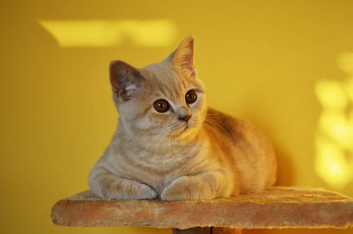
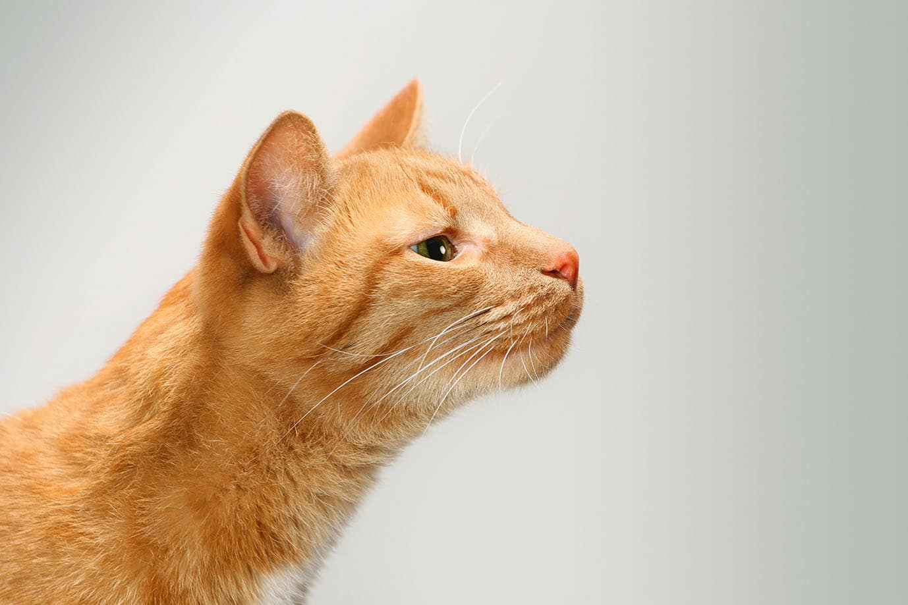
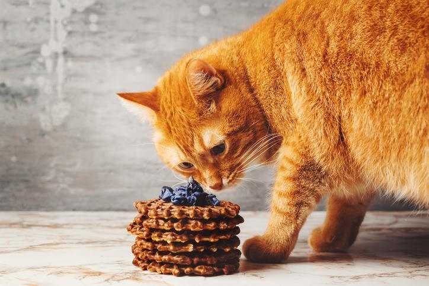

# Cats
Cats have been our companions for thousands of years, yet there is still so much to discover about these mysterious creatures. From their incredible physical abilities to their unique personalities, cats are truly fascinating animals. In this article, we’ll explore 10 interesting facts about cats that you probably didn’t know.

**1. Cats can rotate their ears 180 degrees**

Cats are known for their exceptional hearing abilities, and one of the most impressive things about their ears is their ability to rotate 180 degrees. Unlike humans, who have ears that are fixed in place, a cat’s ears are connected to a set of more than 30 muscles that allow them to move independently and with great precision.

This ability to rotate their ears is essential for cats when hunting, as it allows them to locate prey with pinpoint accuracy. When a cat hears a sound that interests them, they can instantly turn their ears towards the source of the sound and determine its location. This makes them highly effective predators, able to sneak up on their prey with ease.

In addition to their hunting abilities, a cat’s rotating ears also serve as a form of communication. When a cat is feeling threatened or uncomfortable, for example, they may flatten their ears against their head to indicate their discomfort. On the other hand, when a cat is feeling playful or curious, they may hold their ears upright and twitch them in different directions to show their interest.

This interesting fact about cats is just one of the many remarkable physical features that make cats such fascinating animals. Their ears are truly a marvel of engineering, and they play a crucial role in helping cats to navigate their environment and communicate with those around them.

  

**2. Cats have a third eyelid**

Cats have a unique third eyelid, known as the nictitating membrane, which is a thin, translucent layer of tissue that is located at the inner corner of their eyes. Unlike the other two eyelids, the nictitating membrane moves horizontally across the eye, rather than vertically, and is rarely seen in cats unless they are sick or feeling stressed.

The main function of the third eyelid is to protect the cat’s eye from injury and to keep it moist. It serves as an extra layer of protection, helping to shield the eye from dust, debris, and other irritants that could cause damage. Additionally, the third eyelid also contains special glandular tissue that produces a significant portion of the cat’s tear film.

In some cases, the third eyelid may become visible due to a variety of reasons, including illness or injury, dehydration, or stress. When the third eyelid is visible, it can be a sign that something is wrong with the cat, and they should be taken to the vet for a check-up.

**3. A group of cats is called a clowder**

Cats are generally solitary animals, so it is not common to see a large group of cats together. However, feral cats may form colonies, and it is not uncommon for indoor cats in multi-cat households to form social bonds and spend time together.

When a clowder of cats is gathered, they may engage in various behaviours, such as grooming each other, playing, or simply lounging in the same area.

Despite their reputation for being independent, cats are social creatures and benefit from companionship. Providing a safe and comfortable environment for a clowder of cats can lead to happy, healthy feline companions.

While it may not be a term commonly used in everyday language, the word “clowder” is a fun and unique way to refer to a group of cats.

**4. A cat’s purr can help to heal bones**

An interesting fact about cats is that their purr can have healing properties. While it may sound like a myth, studies have shown that the vibrations produced by a cat’s purr can actually help to promote bone growth and repair.

The frequency of a cat’s purr is between 25 and 150 Hertz, which is within the range that has been shown to promote bone growth and healing.

In addition to promoting bone growth, a cat’s purr can also help to reduce stress and promote relaxation, both of which can have positive effects on overall health and healing.

So, next time you hear your cat purring, know that they may be doing more than just expressing contentment and affection – they may be helping to heal your bones!

**5. Cats have an excellent sense of smell**

Cats have an incredible sense of smell, which is up to 14 times stronger than that of humans. Their sense of smell is critical for their survival, as it allows them to locate prey, identify potential dangers, and communicate with other cats.

The part of a cat’s brain that is responsible for processing smells is much larger than that of humans, which allows them to process and differentiate between a wide range of odours.

In addition to their natural sense of smell, some cats are trained to use their sense of smell for various tasks, such as detecting drugs or explosives, or helping individuals with medical conditions such as diabetes. Overall, a cat’s sense of smell is a remarkable and important part of their physiology, contributing to their overall health, safety, and well-being.

  

**6. Cats are desert creatures at heart**

Did you know that cats are actually desert creatures at heart? Despite their popularity as indoor pets, cats have evolved to survive in harsh, arid environments.

Their ancestors were native to desert regions, where they developed several unique adaptations that help them to thrive in hot, dry climates.

For example, cats have developed a highly efficient urinary system that allows them to conserve water by producing highly concentrated urine. They also have a thick coat of fur that helps to insulate them from the heat, as well as specialized sweat glands in their paw pads that allow them to cool off through evaporative cooling. Overall, these adaptations make cats well-suited for life in the desert, and help to explain why they make such unique and fascinating pets.

**7. Cats have a flexible spine**

One of the most interesting facts about cats is their flexible spine. Unlike humans and many other animals, cats have an exceptionally flexible spine that allows them to contort their bodies into all sorts of unusual positions.

This flexibility is due in part to the fact that cats have many more vertebrae in their spines than humans do. While humans typically have 33 vertebrae, cats can have anywhere from 53 to 70.

Their spine also contains a large number of intervertebral discs, which act as shock absorbers and help to cushion the bones during movement. All of these adaptations allow cats to be incredibly agile and athletic, making them excellent hunters and acrobats.

**8. Cats have a keen sense of balance**

Cats are known for their remarkable balance, which is one of the many traits that make them such fascinating animals. Their keen sense of balance is due in part to their inner ear, which contains tiny organs that help them to detect changes in position and movement.

In addition, their long tails also play a critical role in their balance, acting as a counterbalance that helps them to maintain stability during rapid movements or sudden changes in direction.

**9. Cats can’t taste sweet things**

Did you know that cats can’t taste sweet things? While humans and many other animals have a taste receptor that is specifically designed to detect sweet flavours, cats are missing this particular receptor.

Instead, cats have evolved to prefer more savoury and meaty flavours, which makes sense given their carnivorous diet.

This interesting fact about cats is just one of the many examples of how their biology and behaviour have been shaped by evolution over time. So next time you’re snacking on something sweet, and your cat doesn’t seem interested, remember that it’s not because they’re being picky – they simply can’t taste it.

  

**10. Cats are lactose intolerant**

Did you know that cats are lactose intolerant? While many people assume that cats love milk, the truth is that most cats are actually unable to digest lactose, which is the main sugar found in milk.

This means that if you give your cat too much milk or dairy products, they may experience digestive upset, including diarrhoea and vomiting.

While cats can certainly enjoy other types of foods, it’s important to remember that their digestive systems are adapted to process a primarily meat-based diet, and they may not be able to handle certain types of human food.

**Conclusion**

Cats are truly fascinating creatures, and these 10 interesting facts are just the tip of the iceberg.

From their incredible physical abilities to their unique personalities, cats are a never-ending source of wonder and amazement.